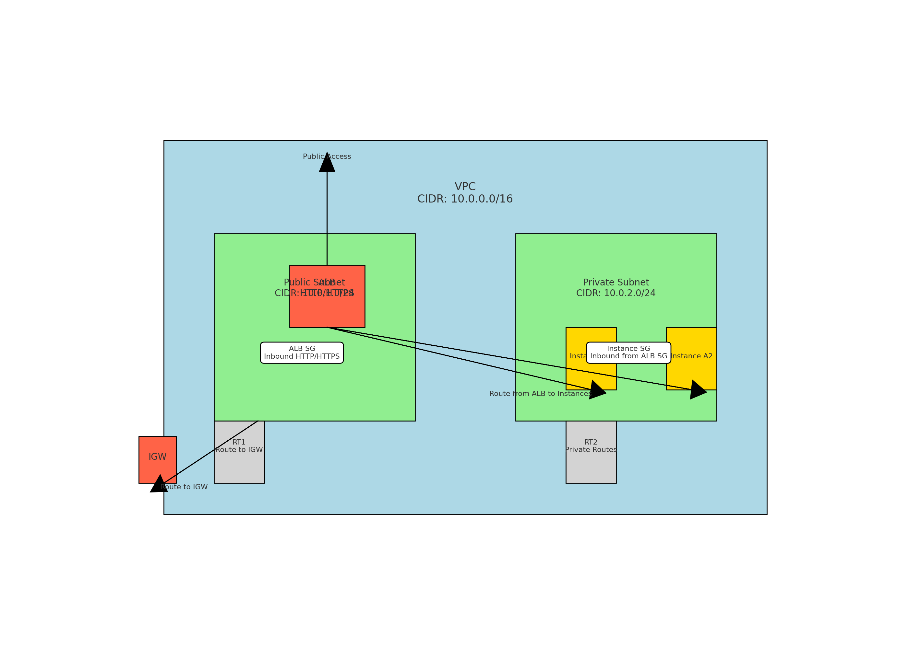

1. Do we need a public subnet for the ALB configuration that connects to instances to private subnet?

#### ALB Configuration with public/ private subnets
      
Yes, you need a public subnet for the ALB configuration that connects to instances in a private subnet. Here’s why:

1. **Internet Access for ALB**: An internet-facing ALB needs to be in a public subnet to receive traffic from the internet. Public subnets have a route to an internet gateway, which is necessary for the ALB to handle external traffic.

2. **Security and Isolation**: Instances can be placed in private subnets for security reasons, ensuring they are not directly accessible from the internet. The ALB in the public subnet acts as a controlled entry point, routing traffic to these instances securely.

### Example Setup:

- **Public Subnet**: Contains the ALB with a security group that allows inbound HTTP/HTTPS traffic from the internet.
- **Private Subnet**: Contains instances that the ALB routes traffic to. The instances have a security group that allows inbound traffic only from the ALB security group.

### Trade-offs:

- **Security**: This setup enhances security by not exposing instances directly to the internet. The ALB acts as a reverse proxy and can enforce additional security measures like SSL termination.
- **Complexity**: Slightly more complex to set up due to the need to configure subnets, security groups, and route tables properly.

Here's a quick diagram to illustrate this setup:

1. **Public Subnet**: ALB with public IP and security group allowing HTTP/HTTPS.
2. **Private Subnet**: Instances with security group allowing traffic only from ALB security group.

    

#### Complete steps for setting up the entire design as above

The detailed steps for setting up the architecture with an internet-facing ALB, private subnets, route tables, and EC2 instances as below:

Sure! Here are the detailed steps for setting up the architecture with an internet-facing ALB, private subnets, route tables, and EC2 instances:

### Prerequisites:
1. AWS account with appropriate permissions.
2. AWS CLI or Management Console access.
3. Basic knowledge of VPC, subnets, route tables, security groups, and EC2.

### Step-by-Step Setup:

#### 1. Create a VPC
1. **Navigate to the VPC Dashboard**: Go to the AWS Management Console, navigate to the VPC dashboard.
2. **Create a VPC**: 
   - Click on "Create VPC".
   - Specify a name for the VPC and a CIDR block (e.g., `10.0.0.0/16`).
   - Select "IPv4 CIDR" and leave the rest as default.
   - Click "Create VPC".

#### 2. Create Subnets
1. **Create Public Subnet**:
   - Click on "Subnets" in the VPC dashboard.
   - Click on "Create subnet".
   - Select the VPC created in step 1.
   - Provide a name for the subnet (e.g., `Public Subnet`).
   - Specify a CIDR block (e.g., `10.0.1.0/24`).
   - Click "Create subnet".
2. **Create Private Subnet**:
   - Repeat the steps for creating a public subnet, but specify a different CIDR block (e.g., `10.0.2.0/24`).
   - Name it `Private Subnet`.

#### 3. Create an Internet Gateway
1. **Create Internet Gateway**:
   - Click on "Internet Gateways" in the VPC dashboard.
   - Click on "Create internet gateway".
   - Provide a name and click "Create".
2. **Attach Internet Gateway to VPC**:
   - Select the internet gateway created.
   - Click on "Actions" and select "Attach to VPC".
   - Select the VPC and attach.

#### 4. Create Route Tables
1. **Create Route Table for Public Subnet**:
   - Click on "Route Tables" in the VPC dashboard.
   - Click on "Create route table".
   - Provide a name (e.g., `Public Route Table`).
   - Select the VPC created in step 1.
   - Click "Create".
   - Select the route table, click on "Routes" and then "Edit routes".
   - Add a route with Destination `0.0.0.0/0` and Target as the internet gateway.
   - Click "Save routes".
   - Associate this route table with the public subnet by clicking on "Subnet Associations", then "Edit subnet associations", and selecting the public subnet.
2. **Create Route Table for Private Subnet**:
   - Repeat the steps for creating a route table.
   - Do not add a route to the internet gateway.
   - Associate this route table with the private subnet.

#### 5. Launch EC2 Instances in the Private Subnet
1. **Launch EC2 Instances**:
   - Navigate to the EC2 dashboard.
   - Click on "Launch Instance".
   - Select an Amazon Machine Image (AMI).
   - Choose an instance type.
   - Configure instance details:
     - Select the VPC and the private subnet.
     - Ensure the "Auto-assign Public IP" is disabled.
   - Add storage and tags as needed.
   - Configure security groups:
     - Create a security group for instances (e.g., `Instance SG`).
     - Add inbound rule to allow traffic from the ALB security group.
   - Review and launch the instance.

#### 6. Create an Application Load Balancer (ALB)
1. **Create ALB**:
   - Navigate to the EC2 dashboard and click on "Load Balancers".
   - Click on "Create Load Balancer" and select "Application Load Balancer".
   - Provide a name for the ALB.
   - Select "Internet-facing" for the scheme.
   - Select the public subnets created.
   - Click "Next".
2. **Configure Security Settings**:
   - Configure listeners for HTTP/HTTPS as required.
   - Select or create an SSL certificate if using HTTPS.
3. **Configure Security Groups**:
   - Create a security group for the ALB (e.g., `ALB SG`).
   - Add inbound rules to allow HTTP/HTTPS traffic from the internet.
4. **Configure Target Group**:
   - Create a new target group.
   - Select instances as the target type.
   - Register the instances created in the private subnet.
5. **Review and Create**:
   - Review the settings and create the load balancer.

#### 7. Update Security Groups
1. **Update Instance Security Group**:
   - Ensure the instance security group (`Instance SG`) allows inbound traffic from the ALB security group (`ALB SG`).

#### 8. Test the Setup
1. **Access the ALB**:
   - Use the DNS name of the ALB to access the application.
   - Verify that the ALB routes traffic to the instances in the private subnet.

This setup ensures secure access to instances in private subnets via an internet-facing ALB, maintaining the isolation of backend instances while providing public access through the ALB.