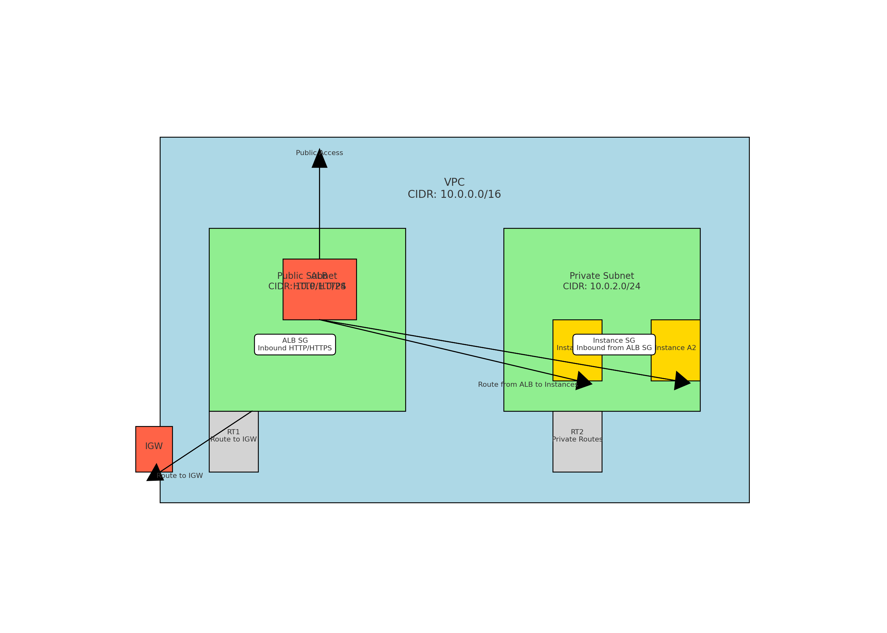

1. Do we need a public subnet for the ALB configuration that connects to instances to private subnet?

#### ALB Configuration with public/ private subnets
      
Yes, you need a public subnet for the ALB configuration that connects to instances in a private subnet. Here’s why:

1. **Internet Access for ALB**: An internet-facing ALB needs to be in a public subnet to receive traffic from the internet. Public subnets have a route to an internet gateway, which is necessary for the ALB to handle external traffic.

2. **Security and Isolation**: Instances can be placed in private subnets for security reasons, ensuring they are not directly accessible from the internet. The ALB in the public subnet acts as a controlled entry point, routing traffic to these instances securely.

### Example Setup:

- **Public Subnet**: Contains the ALB with a security group that allows inbound HTTP/HTTPS traffic from the internet.
- **Private Subnet**: Contains instances that the ALB routes traffic to. The instances have a security group that allows inbound traffic only from the ALB security group.

### Trade-offs:

- **Security**: This setup enhances security by not exposing instances directly to the internet. The ALB acts as a reverse proxy and can enforce additional security measures like SSL termination.
- **Complexity**: Slightly more complex to set up due to the need to configure subnets, security groups, and route tables properly.

Here's a quick diagram to illustrate this setup:

1. **Public Subnet**: ALB with public IP and security group allowing HTTP/HTTPS.
2. **Private Subnet**: Instances with security group allowing traffic only from ALB security group.

    

#### Complete steps for setting up the entire design as above

The detailed steps for setting up the architecture with an internet-facing ALB, private subnets, route tables, and EC2 instances as below:

Sure! Here are the detailed steps for setting up the architecture with an internet-facing ALB, private subnets, route tables, and EC2 instances:

### Prerequisites:
1. AWS account with appropriate permissions.
2. AWS CLI or Management Console access.
3. Basic knowledge of VPC, subnets, route tables, security groups, and EC2.

### Step-by-Step Setup:

#### 1. Create a VPC
1. **Navigate to the VPC Dashboard**: Go to the AWS Management Console, navigate to the VPC dashboard.
2. **Create a VPC**: 
   - Click on "Create VPC".
   - Specify a name for the VPC and a CIDR block (e.g., `10.0.0.0/16`).
   - Select "IPv4 CIDR" and leave the rest as default.
   - Click "Create VPC".

#### 2. Create Subnets
1. **Create Public Subnet**:
   - Click on "Subnets" in the VPC dashboard.
   - Click on "Create subnet".
   - Select the VPC created in step 1.
   - Provide a name for the subnet (e.g., `Public Subnet`).
   - Specify a CIDR block (e.g., `10.0.1.0/24`).
   - Click "Create subnet".
2. **Create Private Subnet**:
   - Repeat the steps for creating a public subnet, but specify a different CIDR block (e.g., `10.0.2.0/24`).
   - Name it `Private Subnet`.

#### 3. Create an Internet Gateway
1. **Create Internet Gateway**:
   - Click on "Internet Gateways" in the VPC dashboard.
   - Click on "Create internet gateway".
   - Provide a name and click "Create".
2. **Attach Internet Gateway to VPC**:
   - Select the internet gateway created.
   - Click on "Actions" and select "Attach to VPC".
   - Select the VPC and attach.

#### 4. Create Route Tables
1. **Create Route Table for Public Subnet**:
   - Click on "Route Tables" in the VPC dashboard.
   - Click on "Create route table".
   - Provide a name (e.g., `Public Route Table`).
   - Select the VPC created in step 1.
   - Click "Create".
   - Select the route table, click on "Routes" and then "Edit routes".
   - Add a route with Destination `0.0.0.0/0` and Target as the internet gateway.
   - Click "Save routes".
   - Associate this route table with the public subnet by clicking on "Subnet Associations", then "Edit subnet associations", and selecting the public subnet.
2. **Create Route Table for Private Subnet**:
   - Repeat the steps for creating a route table.
   - Do not add a route to the internet gateway.
   - Associate this route table with the private subnet.

#### 5. Launch EC2 Instances in the Private Subnet
1. **Launch EC2 Instances**:
   - Navigate to the EC2 dashboard.
   - Click on "Launch Instance".
   - Select an Amazon Machine Image (AMI).
   - Choose an instance type.
   - Configure instance details:
     - Select the VPC and the private subnet.
     - Ensure the "Auto-assign Public IP" is disabled.
   - Add storage and tags as needed.
   - Configure security groups:
     - Create a security group for instances (e.g., `Instance SG`).
     - Add inbound rule to allow traffic from the ALB security group.
   - Review and launch the instance.

#### 6. Create an Application Load Balancer (ALB)
1. **Create ALB**:
   - Navigate to the EC2 dashboard and click on "Load Balancers".
   - Click on "Create Load Balancer" and select "Application Load Balancer".
   - Provide a name for the ALB.
   - Select "Internet-facing" for the scheme.
   - Select the public subnets created.
   - Click "Next".
2. **Configure Security Settings**:
   - Configure listeners for HTTP/HTTPS as required.
   - Select or create an SSL certificate if using HTTPS.
3. **Configure Security Groups**:
   - Create a security group for the ALB (e.g., `ALB SG`).
   - Add inbound rules to allow HTTP/HTTPS traffic from the internet.
4. **Configure Target Group**:
   - Create a new target group.
   - Select instances as the target type.
   - Register the instances created in the private subnet.
5. **Review and Create**:
   - Review the settings and create the load balancer.

#### 7. Update Security Groups
1. **Update Instance Security Group**:
   - Ensure the instance security group (`Instance SG`) allows inbound traffic from the ALB security group (`ALB SG`).

#### 8. Test the Setup
1. **Access the ALB**:
   - Use the DNS name of the ALB to access the application.
   - Verify that the ALB routes traffic to the instances in the private subnet.

This setup ensures secure access to instances in private subnets via an internet-facing ALB, maintaining the isolation of backend instances while providing public access through the ALB.

============================================================================================================================================================

2. ALB vs NLB difference with small example?

Amazon Web Services (AWS) offers different types of load balancers under its Elastic Load Balancing (ELB) service: Application Load Balancer (ALB) and Network Load Balancer (NLB). Each serves different use cases based on their features and capabilities. Here's a comparison of ALB and NLB with a small example for each.

### Application Load Balancer (ALB)

#### Key Features
- **Layer 7 Load Balancing**: ALB operates at the application layer (Layer 7 of the OSI model) and can inspect the contents of the traffic.
- **Routing Based on Content**: It supports advanced request routing based on URL path, host headers, HTTP methods, query parameters, and source IP address.
- **WebSockets Support**: ALB supports WebSocket and HTTP/2 traffic.
- **SSL Termination**: ALB can offload SSL/TLS termination.
- **Sticky Sessions**: ALB supports session stickiness (also known as session affinity) to bind user sessions to specific instances.
- **Health Checks**: It provides application-layer health checks.

#### Small Example
**Scenario**: You have a web application with different microservices for handling user requests, such as `/login`, `/register`, and `/dashboard`.

1. **Create an ALB**:
   - Listener: Port 80 (HTTP) or Port 443 (HTTPS).
   - Rules: 
     - If the path is `/login`, forward to the `Login` target group.
     - If the path is `/register`, forward to the `Register` target group.
     - If the path is `/dashboard`, forward to the `Dashboard` target group.

2. **Target Groups**:
   - `Login` target group: Instances handling login requests.
   - `Register` target group: Instances handling registration requests.
   - `Dashboard` target group: Instances handling user dashboards.

#### Example URL Routing
- `http://example.com/login` -> `Login` target group
- `http://example.com/register` -> `Register` target group
- `http://example.com/dashboard` -> `Dashboard` target group

### Network Load Balancer (NLB)

#### Key Features
- **Layer 4 Load Balancing**: NLB operates at the transport layer (Layer 4 of the OSI model), routing connections based on IP protocol data.
- **High Performance**: It handles millions of requests per second with ultra-low latency.
- **Static IP Support**: NLB provides a static IP address for the load balancer.
- **Preserves Source IP**: The original client IP is preserved, which is useful for IP-based security.
- **Health Checks**: It provides network-layer health checks.
- **TLS Termination**: Supports offloading TLS termination.

#### Small Example
**Scenario**: You have a high-performance application that needs to handle a large volume of TCP traffic, such as a real-time financial data processing service.

1. **Create an NLB**:
   - Listener: Port 443 (TCP).
   - Targets: A group of EC2 instances in a private subnet that process the financial data.

2. **Target Group**:
   - `FinancialProcessing` target group: Instances running the data processing service.

#### Example Traffic Flow
- Client initiates a connection to `https://financial.example.com:443`.
- The NLB receives the connection request and forwards it to one of the instances in the `FinancialProcessing` target group based on the load balancing algorithm.

### Summary of Differences

| Feature              | Application Load Balancer (ALB)                    | Network Load Balancer (NLB)                          |
|----------------------|----------------------------------------------------|------------------------------------------------------|
| OSI Layer            | Layer 7 (Application)                              | Layer 4 (Transport)                                  |
| Protocols            | HTTP, HTTPS, WebSockets                            | TCP, UDP, TLS                                        |
| Advanced Routing     | Path-based, Host-based, HTTP header, Query string  | Not supported                                        |
| SSL/TLS Termination  | Yes                                                | Yes                                                  |
| Performance          | Lower throughput, higher latency                   | High throughput, ultra-low latency                   |
| Preserves Source IP  | No (uses ALB IP)                                   | Yes                                                  |
| Static IP Support    | No (uses DNS name)                                 | Yes                                                  |
| Health Checks        | Application-layer (HTTP/HTTPS)                     | Network-layer (TCP/UDP)                              |
| Use Case Example     | Web applications with complex routing needs        | High-performance, low-latency applications (e.g., real-time data processing) |

Choosing between ALB and NLB depends on your specific application needs. ALB is better for web applications requiring complex routing and SSL offloading at the application layer, while NLB is ideal for high-performance applications requiring low latency and static IP addresses at the transport layer.

