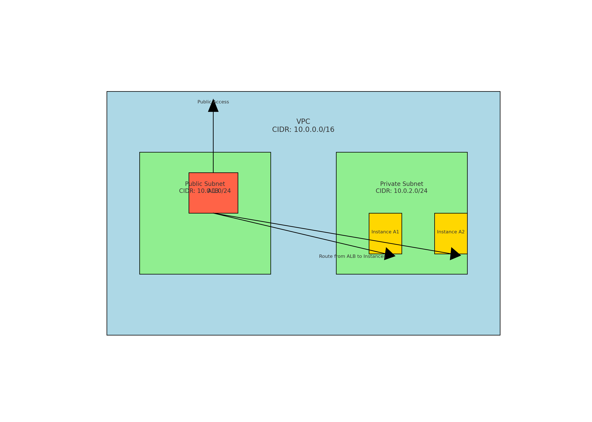
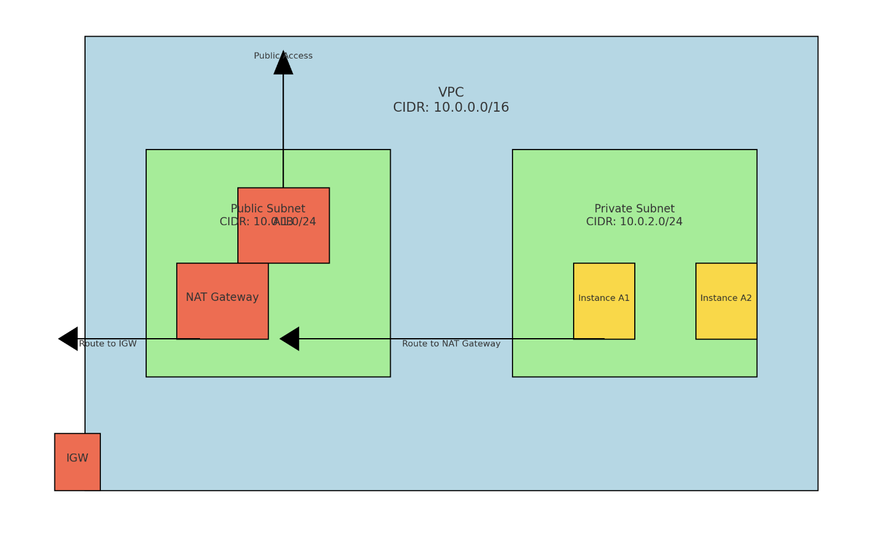

1. What does mean like creating AWS Route table and add a route 0.0.0.0/0 to the internet gateway? is that mean to accept a traffic from internet or to forward a traffic from public subnets to the internet via internet gateway?

Creating an AWS route table and adding a route with destination `0.0.0.0/0` to the Internet Gateway (IGW) means you are setting up the route table to direct any traffic destined for an address that doesn't match a more specific route to the Internet Gateway. Here’s what it implies:

### Route Table Configuration

1. **Destination `0.0.0.0/0`**:
   - This represents the default route, which matches any IP address. It essentially means "all traffic."

2. **Target: Internet Gateway (IGW)**:
   - This specifies that the traffic should be directed to the Internet Gateway. The Internet Gateway then forwards this traffic to the internet.

### Purpose

- **Outbound Internet Access**: Instances in the public subnet need to access the internet for updates, downloading dependencies, or other external communication.
- **Inbound Internet Access**: Instances in the public subnet also need to be accessible from the internet (e.g., web servers that need to serve content to external users).

### Does It Mean Accepting Traffic from the Internet?

Yes, adding a route `0.0.0.0/0` to the Internet Gateway in a public subnet's route table facilitates both outbound and inbound traffic. Here’s how it works:

- **Outbound Traffic**: When an instance in the public subnet wants to send a request to the internet (e.g., downloading updates), the request is routed to the Internet Gateway, which forwards it to the internet.
- **Inbound Traffic**: The Internet Gateway also allows inbound traffic from the internet to reach instances in the public subnet. This is necessary for services like web servers that need to accept requests from users over the internet.

### Example Scenario

1. **Outbound Traffic**:
   - An instance in the public subnet wants to download updates from an internet server.
   - The instance sends the request.
   - The request is routed to the Internet Gateway.
   - The Internet Gateway forwards the request to the internet.
   - The internet server responds to the request.
   - The response is received by the Internet Gateway.
   - The Internet Gateway forwards the response back to the instance in the public subnet.

2. **Inbound Traffic**:
   - A user on the internet wants to access a web server hosted on an instance in the public subnet.
   - The user sends a request to the web server’s public IP address.
   - The request is received by the Internet Gateway.
   - The Internet Gateway forwards the request to the instance in the public subnet.
   - The web server processes the request and sends the response back to the user via the Internet Gateway.

### Security Considerations

- **Public Subnet Instances**: By default, instances in public subnets have direct access to the internet and can be accessed from the internet. Therefore, it's crucial to secure these instances using security groups and network ACLs.
- **Private Subnet Instances**: Instances in private subnets do not have a direct route to the internet via the Internet Gateway. They can only access the internet through a NAT Gateway (for outbound traffic only) and are not directly accessible from the internet.

### Diagram

Here’s an example setup for using an Internet Gateway with a public subnet:

1. **VPC**: `10.0.0.0/16`
2. **Public Subnet**: `10.0.1.0/24`
3. **Private Subnet A**: `10.0.2.0/24`
4. **Private Subnet B**: `10.0.3.0/24`
5. **Internet Gateway (IGW)** attached to the VPC
6. **Route Table for Public Subnet**:
   - Route `0.0.0.0/0` to the Internet Gateway (IGW)
7. **NAT Gateway** in the public subnet (if necessary for private subnets)
8. **Route Table for Private Subnets**:
   - Route `0.0.0.0/0` to the NAT Gateway

This configuration ensures that instances in the public subnet can communicate with the internet both inbound and outbound, while instances in private subnets remain isolated from direct internet access.

====================================================================================================================================================================

2. Do we really need internet gateway in AWS to access the services under private subnet A (VPC A)? Can we add ALB with public IP to the VPC A for accessing the services publicly within VPC A? which is right and what are the tradeoffs?

No, you do not need an Internet Gateway to access services under Private Subnet A (VPC A) if you use an Application Load Balancer (ALB) with a public IP. Here’s a detailed explanation of both approaches and their trade-offs:

### Using an Internet Gateway

**Setup:**
- **Internet Gateway (IGW):** Attach an IGW to VPC A.
- **Public Subnet:** Create a public subnet in VPC A and associate it with a route table that routes 0.0.0.0/0 traffic to the IGW.
- **Private Subnet:** Place your services in Private Subnet A, which does not have direct internet access.
- **NAT Gateway (Optional):** If instances in Private Subnet A need to initiate outbound internet connections, use a NAT Gateway in the public subnet.

**Access:**
- Public access is provided by assigning Elastic IPs to instances or placing them behind an ALB in the public subnet.

**Pros:**
1. **Direct Internet Access:** Instances can initiate outbound connections if required (via NAT Gateway).
2. **Security:** Segregation of public-facing and private resources.

**Cons:**
1. **Cost:** Additional costs for NAT Gateway and public subnet resources.
2. **Complexity:** More components to manage (IGW, NAT Gateway, route tables).

### Using a Public ALB

**Setup:**
- **ALB:** Create an ALB in VPC A and configure it to be internet-facing.
- **Private Subnet:** Place your services in Private Subnet A.
- **Security Groups:** Configure security groups to allow traffic from the ALB to instances in Private Subnet A.

**Access:**
- Public access is provided via the ALB, which routes traffic to services in Private Subnet A.

**Pros:**
1. **Simplicity:** Fewer components to manage.
2. **Cost:** No need for NAT Gateway or additional public subnets.
3. **Direct Public Access:** ALB provides direct access to private services.

**Cons:**
1. **Security:** All traffic to private instances goes through the ALB, which must be properly secured.
2. **Outbound Connections:** Instances in the private subnet cannot initiate outbound connections unless additional configurations like NAT Gateway or VPC endpoints are used.

### Trade-offs and Best Practices

#### Security:
- **Public ALB:** Simplifies access management by centralizing ingress traffic control but requires robust security measures (e.g., WAF, security groups, TLS).
- **Internet Gateway and NAT Gateway:** Offers a more segmented network design, enhancing security by isolating public and private resources but adds complexity and cost.

#### Cost:
- **Public ALB:** More cost-effective for simple architectures as it reduces the need for NAT Gateways and additional subnets.
- **Internet Gateway and NAT Gateway:** Can be more expensive due to additional AWS resources.

#### Complexity:
- **Public ALB:** Easier to manage for small to medium-sized deployments with straightforward access requirements.
- **Internet Gateway and NAT Gateway:** Suitable for more complex environments needing detailed network segmentation and control.

### Example Setup Using Public ALB



`
Explaination to the above diagram
`

   1A. do we need a public subnet for the ALB configuration that connects to instances to private subnet?

   

      
1. **ALB Configuration:**
   - Internet-facing ALB with listeners for HTTP/HTTPS.
   - Target group with instances in Private Subnet A.

2. **Security Groups:**
   - ALB Security Group: Allow inbound traffic from the internet (HTTP/HTTPS).
   - Instance Security Group: Allow inbound traffic from the ALB Security Group.

#### Example ALB Setup:

**Security Group for ALB:**
```plaintext
Inbound Rule:
- Protocol: HTTPS
  Port: 443
  Source: 0.0.0.0/0 (or restricted IP ranges)
```

**Security Group for Instances:**
```plaintext
Inbound Rule:
- Protocol: HTTP
  Port: 80
  Source: Security Group ID of ALB
```
Certainly! Below is an example setup using an Internet Gateway and a NAT Gateway to access services in a private subnet. This setup allows instances in the private subnet to initiate outbound connections to the internet while keeping them inaccessible from the internet directly.

### Example Setup Using Internet Gateway and NAT Gateway




#### Overview

1. **Internet Gateway (IGW):** Provides a way for instances to access the internet.
2. **Public Subnet:** Contains the NAT Gateway and potentially the public-facing Application Load Balancer (ALB).
3. **Private Subnet:** Contains the instances running your services.
4. **NAT Gateway:** Allows instances in the private subnet to initiate outbound connections to the internet.

### Steps to Set Up

1. **Create VPC with Public and Private Subnets:**
   - **VPC CIDR:** `10.0.0.0/16`
   - **Public Subnet CIDR:** `10.0.1.0/24`
   - **Private Subnet CIDR:** `10.0.2.0/24`

2. **Create and Attach an Internet Gateway:**
   - Attach the Internet Gateway to the VPC.

3. **Create a NAT Gateway in the Public Subnet:**
   - Allocate an Elastic IP and associate it with the NAT Gateway.

4. **Set Up Route Tables:**
   - **Public Route Table:** Route internet-bound traffic (0.0.0.0/0) to the Internet Gateway.
   - **Private Route Table:** Route internet-bound traffic (0.0.0.0/0) to the NAT Gateway.

5. **Launch Instances:**
   - Launch instances in the private subnet.

6. **Configure Security Groups:**
   - Security groups for the instances to allow inbound traffic from the public ALB and allow outbound traffic to the internet via NAT Gateway.

### Detailed Steps

#### 1. Create VPC with Public and Private Subnets

```plaintext
VPC CIDR: 10.0.0.0/16
Public Subnet CIDR: 10.0.1.0/24
Private Subnet CIDR: 10.0.2.0/24
```

#### 2. Create and Attach an Internet Gateway

1. **Create Internet Gateway:**
   - Name: `my-internet-gateway`
   - Attach it to `my-vpc`

2. **Update Public Subnet Route Table:**
   - Route internet-bound traffic to the Internet Gateway.
   - Destination: `0.0.0.0/0`
   - Target: `igw-xxxxxxxx`

#### 3. Create a NAT Gateway in the Public Subnet

1. **Allocate Elastic IP:**
   - Allocate a new Elastic IP.

2. **Create NAT Gateway:**
   - Name: `my-nat-gateway`
   - Subnet: `my-public-subnet`
   - Elastic IP: Associate the allocated Elastic IP.

3. **Update Private Subnet Route Table:**
   - Route internet-bound traffic to the NAT Gateway.
   - Destination: `0.0.0.0/0`
   - Target: `nat-xxxxxxxx`

#### 4. Set Up Route Tables

**Public Route Table:**
```plaintext
Destination        Target
10.0.0.0/16        local
0.0.0.0/0          igw-xxxxxxxx
```

**Private Route Table:**
```plaintext
Destination        Target
10.0.0.0/16        local
0.0.0.0/0          nat-xxxxxxxx
```

#### 5. Launch Instances in the Private Subnet

1. **Launch Instances:**
   - Instances: `instance-a1`, `instance-a2`
   - Subnet: `my-private-subnet`

#### 6. Configure Security Groups

**Security Group for Instances in Private Subnet:**

```plaintext
Inbound Rules:
- Type: HTTP
  Protocol: TCP
  Port Range: 80
  Source: Security Group ID of the ALB

Outbound Rules:
- Type: All traffic
  Protocol: All
  Port Range: All
  Destination: 0.0.0.0/0
```

**Security Group for ALB in Public Subnet:**

```plaintext
Inbound Rules:
- Type: HTTP
  Protocol: TCP
  Port Range: 80
  Source: 0.0.0.0/0

Outbound Rules:
- Type: HTTP
  Protocol: TCP
  Port Range: 80
  Destination: Security Group ID of the Instances in Private Subnet
```

### Conclusion

Using a public ALB without an Internet Gateway is a valid approach for providing public access to services in a private subnet, with simpler management and lower costs. However, it requires careful security configurations. Using an Internet Gateway with NAT Gateways offers more granular control and better isolation but at higher cost and complexity. The choice depends on your specific requirements, budget, and desired level of security.

=====================================================================================================================================================

3. AWS NAT Gateway in real time scenario?

### AWS NAT Gateway in a Real-Time Scenario

The AWS NAT (Network Address Translation) Gateway allows instances in a private subnet to connect to the internet or other AWS services, but it prevents the internet from initiating connections with those instances. This is crucial for maintaining security while allowing necessary outbound communication.

### Real-Time Scenario

#### Use Case: A Secure Web Application

Suppose you have a web application hosted on AWS that needs to maintain high security. Your architecture includes:

- A public subnet for the Application Load Balancer (ALB).
- A private subnet for the web and application servers.
- A private subnet for the database servers.

### Architecture Diagram

1. **VPC**: `10.0.0.0/16`
2. **Public Subnet**: `10.0.1.0/24` (for ALB)
3. **Private Subnet A**: `10.0.2.0/24` (for web and application servers)
4. **Private Subnet B**: `10.0.3.0/24` (for database servers)

### Steps to Set Up the Architecture

#### 1. Create a VPC

- **CIDR Block**: `10.0.0.0/16`
  
#### 2. Create Subnets

- **Public Subnet**: `10.0.1.0/24`
- **Private Subnet A**: `10.0.2.0/24`
- **Private Subnet B**: `10.0.3.0/24`

#### 3. Create an Internet Gateway (IGW)

- **Attach the IGW to the VPC**.

#### 4. Configure Route Tables

- **Public Route Table**:
  - **Route**: `0.0.0.0/0` → IGW
  - **Associations**: Public Subnet (`10.0.1.0/24`)

- **Private Route Table**:
  - **Route**: `0.0.0.0/0` → NAT Gateway (will be created)
  - **Associations**: Private Subnets (`10.0.2.0/24`, `10.0.3.0/24`)

#### 5. Create a NAT Gateway

- **Elastic IP**: Allocate a new Elastic IP.
- **Subnet**: Public Subnet (`10.0.1.0/24`).
- **Update the Private Route Table**:
  - **Route**: `0.0.0.0/0` → NAT Gateway

#### 6. Set Up Security Groups

- **ALB Security Group**:
  - Allow inbound traffic on HTTP (80) and HTTPS (443) from the internet.
  - Allow outbound traffic to the internet.

- **Web and Application Servers Security Group**:
  - Allow inbound traffic from the ALB Security Group.
  - Allow outbound traffic to the internet (via NAT Gateway) for updates, API calls, etc.

- **Database Servers Security Group**:
  - Allow inbound traffic from the Web and Application Servers Security Group.
  - Deny all inbound traffic from the internet.

#### 7. Deploy Resources

- **ALB**: Deploy the ALB in the public subnet.
- **Web and Application Servers**: Deploy in Private Subnet A.
- **Database Servers**: Deploy in Private Subnet B.

### Summary of the Configuration

1. **Public Subnet**: Contains the ALB with direct access to the internet.
2. **Private Subnet A**: Contains web and application servers that can initiate outbound connections to the internet via the NAT Gateway.
3. **Private Subnet B**: Contains database servers with no direct internet access but can communicate with web and application servers in Private Subnet A.

### Example Diagram

![AWS NAT Gateway Setup] 


   
   #### Diagram Overview
      - The VPC (`10.0.0.0/16`) contains both public and private subnets.
      - The public subnet (`10.0.1.0/24`) hosts the Application Load Balancer (ALB) and NAT Gateway.
      - Private Subnet A (`10.0.2.0/24`) hosts the web and application servers.
      - Private Subnet B (`10.0.3.0/24`) hosts the database servers.
      - The Internet Gateway (IGW) provides internet access to the public subnet.
      - The NAT Gateway allows instances in the private subnets to connect to the internet for updates and external communication. 
   

### Detailed Example

Let's break down the steps with an example.

1. **Creating the VPC and Subnets**:
   - Use the AWS Management Console, CLI, or CloudFormation to create the VPC and subnets.

2. **Internet Gateway and Route Table Configuration**:
   - Attach the IGW to your VPC.
   - Create a route table for the public subnet with a route to the IGW.
   - Create a private route table and associate it with your private subnets.

3. **NAT Gateway Setup**:
   - Allocate an Elastic IP.
   - Create a NAT Gateway in the public subnet.
   - Update the private route table to direct outbound traffic to the NAT Gateway.

4. **Deploying the ALB**:
   - Create the ALB in the public subnet.
   - Configure listeners for HTTP (80) and HTTPS (443).

5. **Configuring Security Groups**:
   - Define security rules to allow appropriate traffic flows between your components.

6. **Deploying Web and Application Servers**:
   - Launch instances in the private subnet with a security group that allows inbound traffic from the ALB and outbound traffic to the internet via the NAT Gateway.

7. **Database Servers Configuration**:
   - Launch instances in the private subnet with a security group that allows inbound traffic from the web and application servers.

### Benefits of Using NAT Gateway

1. **Security**: Instances in private subnets are not directly exposed to the internet.
2. **Controlled Access**: Outbound internet access is allowed for updates, patches, and external API calls, while inbound access is restricted.
3. **Scalability**: NAT Gateway scales automatically to accommodate your network traffic.

This setup ensures that your private instances can securely access the internet for necessary operations while remaining protected from inbound internet traffic.

=====================================================================================================================================================

4. What does mean like creating AWS Route table and add a route 0.0.0.0/0 to the NAT Gateway? is that mean to accept a traffic from internet?

When you create an AWS route table and add a route with destination `0.0.0.0/0` to the NAT Gateway, it means you are specifying that any outbound traffic from the instances in the private subnet that doesn't match a more specific route in the route table should be directed to the NAT Gateway. Here’s a breakdown:

### Route Table Configuration

1. **Destination `0.0.0.0/0`**:
   - This represents the default route, which matches any IP address. It essentially means "all traffic."

2. **Target: NAT Gateway**:
   - This specifies that the traffic should be directed to the NAT Gateway. The NAT Gateway will then send this traffic to the internet.

### Purpose

- **Outbound Internet Access**: Instances in the private subnet need to access the internet for updates, downloading dependencies, or other external communication. Since these instances are in a private subnet, they cannot directly communicate with the internet.
- **Security**: The NAT Gateway allows these instances to initiate outbound connections, but it does not allow inbound connections from the internet. This maintains the security of the instances in the private subnet while allowing them the necessary access to external resources.

### Does It Mean Accepting Traffic from the Internet?

No, it does not mean accepting traffic from the internet. The route `0.0.0.0/0` to the NAT Gateway is for outbound traffic only. Here’s how it works:

- **Outbound Traffic**: When an instance in the private subnet wants to send a request to the internet, the request is routed to the NAT Gateway, which forwards it to the internet.
- **Inbound Traffic**: The NAT Gateway does not accept unsolicited inbound traffic from the internet. It only allows responses to requests that originated from instances in the private subnet. This means that external sources cannot initiate a connection to instances within the private subnet.

### Example Scenario

1. **Instance in Private Subnet A** (with route table containing `0.0.0.0/0` to NAT Gateway) wants to download updates from an internet server.
2. The instance sends the request.
3. The request is routed to the NAT Gateway.
4. The NAT Gateway forwards the request to the internet.
5. The internet server responds to the request.
6. The response is received by the NAT Gateway.
7. The NAT Gateway forwards the response back to the instance in the private subnet.

This setup allows secure and controlled outbound internet access for instances in private subnets without exposing them to unsolicited inbound traffic from the internet.